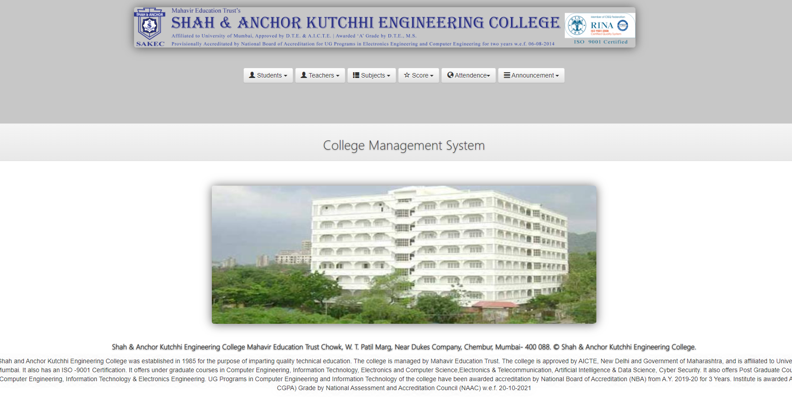
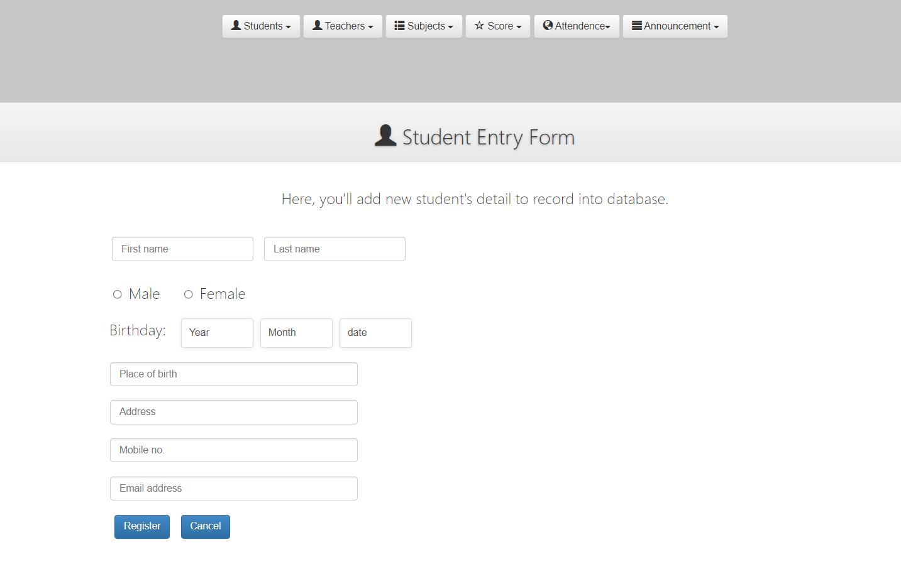
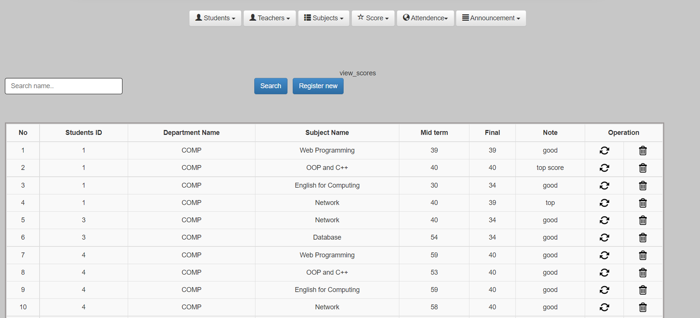
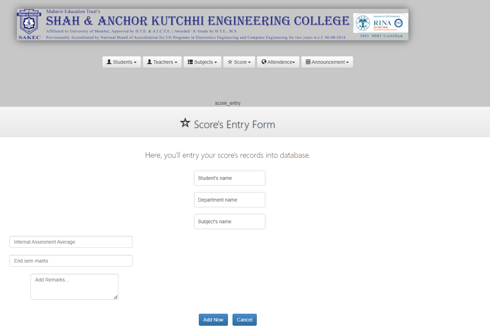
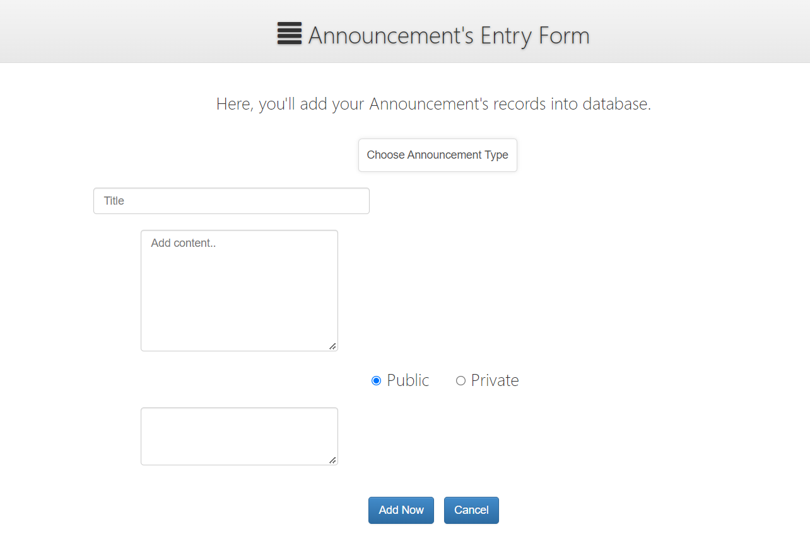
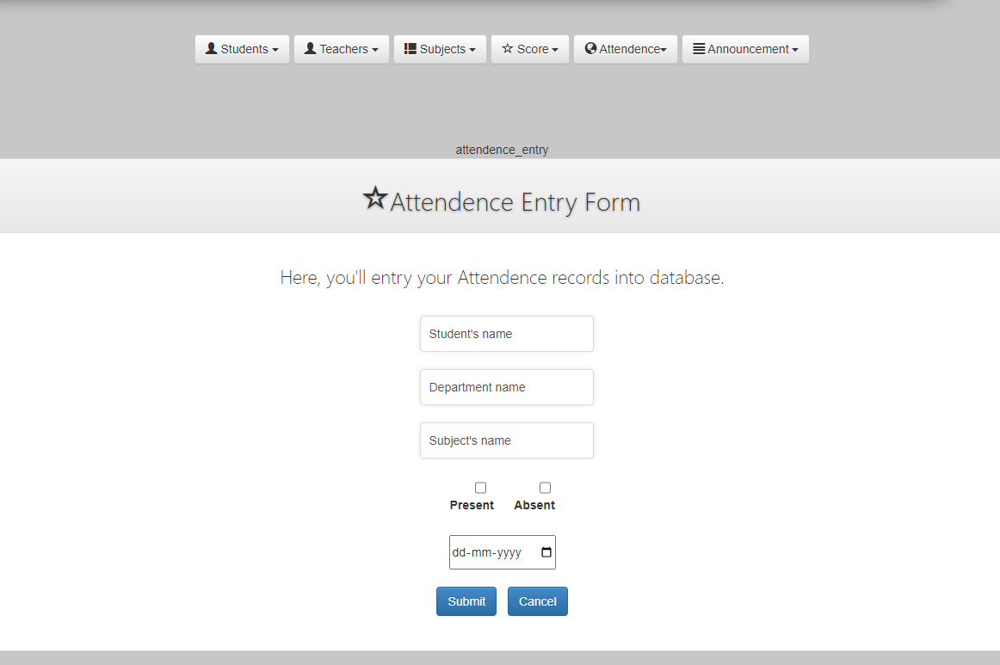

# College Management System  

A web-based portal for managing college operations, designed using PHP, MySQL, and Apache (LAMP stack).  

## Features  
- Role-based login for admins, staff, and students.  
- Upload and download data with ease.  

## Deployment Steps  
1. Install XAMPP  
2. Copy the `CMS` folder to the `htdocs` directory in XAMPP.  
3. Start **Apache** and **MySQL** in the XAMPP Control Panel.  
4. Open your browser and set up the database.  
5. Import `assignment.sql` into the database using phpMyAdmin.  
6. Access the system at `localhost/college-management-system/index.php`.  

## Admin Login  
- **Username:** admin  
- **Password:** admin  

## Snapshots

  

  

  

  
  

  
  

